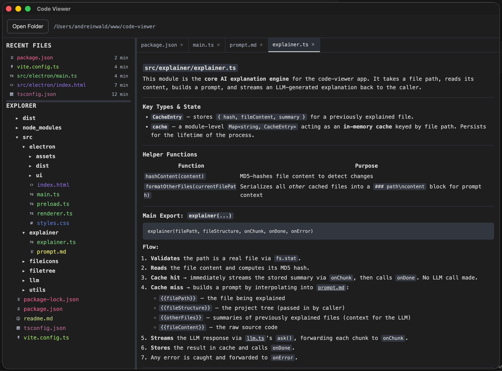

# Next-Gen AI IDE
Read the logic, not the code.
- Working with programming language you dont know
- Checking that the code does what it's supposed to
- Diving into an unfamiliar repository

A desktop app for exploring code repositories with AI-powered explanations.

Open any folder, browse its file tree, and click a file to get an LLM explain it. Explanations stream in real time, render as markdown, and are cached so the same file is never re-queried. You can open multiple files at once in separate tabs and jump between them while they load in parallel.

The LLM sees the full repo structure and the content of other files you've already opened, so explanations have context about the codebase. If the LLM mentions related files, you can click the links to open them directly.

Coding Agents (Claude Code, Codex, etc) connected via [Agent Client Protocol](https://agentclientprotocol.com)
